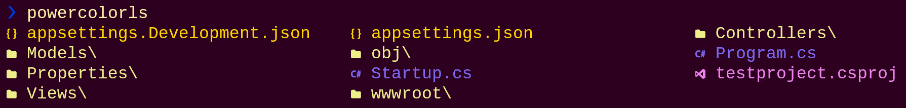

# PowerColorLS

A PowerShell module that displays a colorized directory and file listing with icons. Inspired by [colorls](https://github.com/athityakumar/colorls)



## Overview

*PowerColorLS* is a PowerShell module that displays a colorized directory and file listing with icons in the terminal.
For the module to work, you must first install [Terminal-Icons](https://github.com/devblackops/Terminal-Icons/) and setup the [Nerd Fonts](https://github.com/ryanoasis/nerd-fonts/)

## Installation
To install the module from the [PowerShell Gallery](https://www.powershellgallery.com/):
```powershell
Install-Module -Name PowerColorLS -Repository PSGallery
```

## Usage
```powershell
Import-Module PowerColorLS
PowerColorLS
PowerColorLS -l
PowerColorLS *.txt -l -a
PowerColorLS -h
```

## Help
To get help about available arguments, run:
```powershell
PowerColorLS --help
```

Output of help command:
```
Usage: PowerColorLs [OPTION]... [FILE]...
List information about files and directories (the current directory by default).
Entries will be sorted alphabetically if no sorting option is specified.

        -a, --all               do not ignore hidden files and files starting with .
        -l, --long              use a long listing format
        -1                      list one file per line
        -d, --dirs              show only directories
        -f, --files             show only files
        -ds, --ds, -sds, --sds, --show-directory-size
                                show directory size (can take a long time)

sorting options:

        -sd, --sd, --sort-dirs, --group-directories-first
                                sort directories first
        -sf, --sf, --sort-files, --group-files-first
                                sort files first
        -t, -st, --st
                                sort by modification time, newest first

general options:

        -h, --h, --help         prints this help
```

## Alias to ls
```powershell
Set-Alias -Name ls -Value PowerColorLS -Option AllScope
```